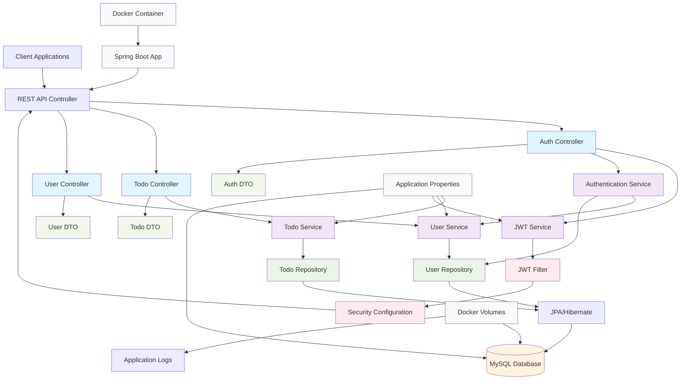
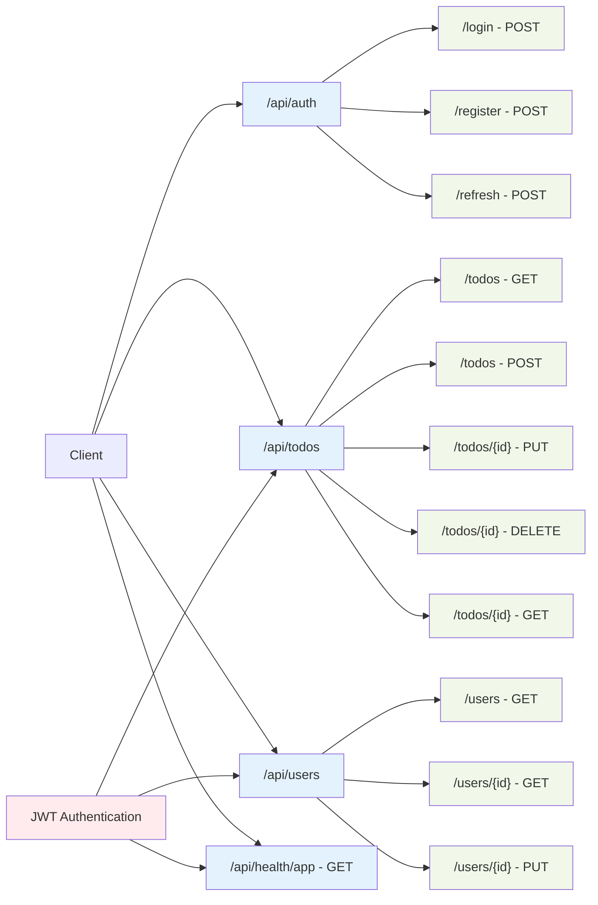
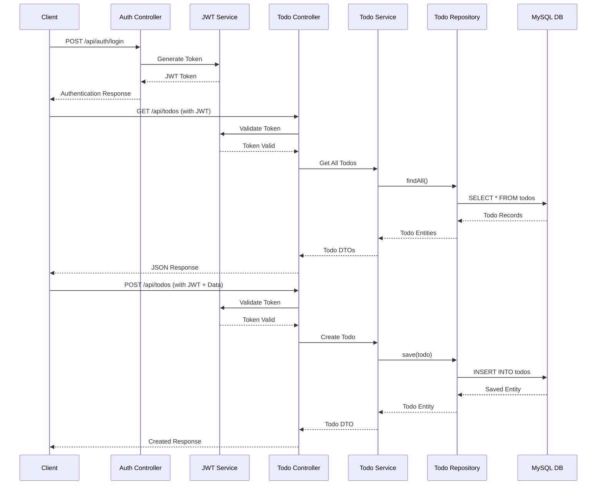

# 1. Overview

Restful API for managing task persistence.

---

# 2. Level of complexity

==BEGINNER==: this version is properly for developer technical skills in the use of the technical stack, it is the foundational part for building projects of more complexity.

---

# 3. Major Releases Timeline

## 0.2.0

- Released on September 2025
- Unit tested
- Spec coverage of 70%

## 0.1.5

- Special features such as rate limiting

---

# 4. Architectural Diagram

## Component relationships:

## General diagram:

## API Endpoints flow:

## Data Flow:

---

# 5. Technical Specs

## 5.1 Architectural Pattern:

1. **MVC Pattern**

   - Separation of concerns between Model, View, and Controller
   - RESTful API design principles

2. **Repository Pattern**

   - Data access abstraction through JPA repositories
   - Clean separation between data access and business logic

3. **Dependency Injection**

   - Spring's IoC container for managing dependencies
   - Constructor-based injection for services

4. **DTO Pattern**

   - Data Transfer Objects for API request/response
   - Protects entity models from direct exposure

5. **Builder Pattern**

   - Likely used for complex object creation (JWT tokens, responses)

6. **Factory Pattern**
   - Service instantiation through Spring's component factory

## 5.2 Technology Stack

- **Backend**: Java 17, Spring Boot
- **Database**: MySQL
- **Authentication**: JWT
- **Deployment**: Docker, multi-platform support (AMD64/ARM64)
- **Build Tool**: Maven

---

# 6. API Endpoints (Primary Adapters)

---

# 7. Request/Response Format (Domain Translation)

---

# 8. Special features:

### Key Features

- RESTful API endpoints for Todo management
- JWT-based authentication and authorization
- Multi-environment configuration (dev, docker, production)
- Data seeding capabilities (configurable)
- Hibernate ORM with MySQL dialect
- Containerized deployment with Docker
- Volume mounting for configuration

### Security

- JWT token authentication
- Password encryption
- Configurable token expiration (8 hours default)
- Separate user roles (admin, supervisor, users)

### Configuration

- Environment-specific properties files
- Externalized configuration through volume mounting
- Configurable database connection
- Configurable logging levels

---

# 9. Future Architectural Improvements

### Architectural Improvements

1. **Microservices Architecture**

   - Split into smaller, focused services (auth, todo, user management)
   - API Gateway for request routing and cross-cutting concerns

2. **Event-Driven Architecture**

   - Implement message brokers (RabbitMQ/Kafka) for asynchronous processing
   - Event sourcing for better audit trails and state recovery

3. **CQRS Pattern**

   - Separate read and write operations for better scalability
   - Optimized read models for query performance

4. **Domain-Driven Design**

   - Stronger domain model with bounded contexts
   - More explicit aggregates and value objects

5. **Hexagonal Architecture**

   - Ports and adapters to decouple business logic from infrastructure
   - Better testability and flexibility for storage options

6. **Infrastructure**

   - Kubernetes deployment for orchestration
   - Service mesh for inter-service communication
   - CI/CD pipeline integration
   - Centralized logging and monitoring (ELK stack)
   - Distributed tracing (Jaeger/Zipkin)

7. **Resilience Patterns**
   - Circuit breakers for fault tolerance
   - Rate limiting
   - Retry mechanisms
   - Bulkhead pattern for resource isolation
   - No monitoring implementation

---

# 10. Branches

1. ==Main==: it contains the latest deployed and published codebase, this one has been tested against unit, integration and end 2 end, also, there are special directories related to developer such as: devops (CI/CD pipelines), sshots (images for README file) and developer (diagrams, postman yaml files, documentation)

2. ==Stage==: target branch for test the execution of the CI/CD pipelines, includes the interaction with the CI tools and cloud providers, the use of this branch is suggested for QA and DevOps teams. Pre-release version management, this one should be the only one merged with main branch.

3. ==Unstable==: it containts the test codebase (unit, integration, end 2 end), it interacts with experimental and stage branches, must not merge with main.

4. ==Experimental==: alpha version of the codebase, all features are built here, it interacts with unstable and stage, must not be merged directly with main branch.

5. ==Refactor==: special feature requires by Experimental branch, the intention is to not affect the latest run version of the codebase contained in Experimental, if must be merged just with experimental branch.

---

# 11. Leftovers:
